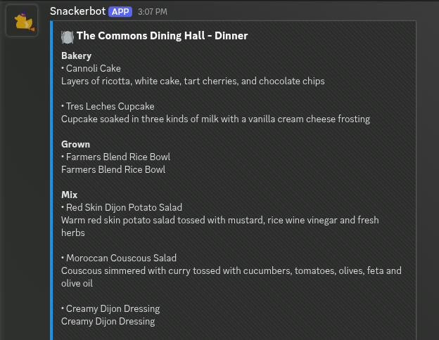

# Snackerbot

Discord bot that fetches and lists menu items for the four RPI dining halls.

For now the only implemented filtering is for vegetarian items.

## Setup

Node.js v18+ is required

- Clone the repo and run `npm install`
- Copy `.env.example` to `.env` for the bot token
- Run `node index.js`

## Commands

- `/snackerbot [hall] [meal] [vegetarian]` - Get dining hall menu
- `/refresh-menus` - Manually refresh menu cache
